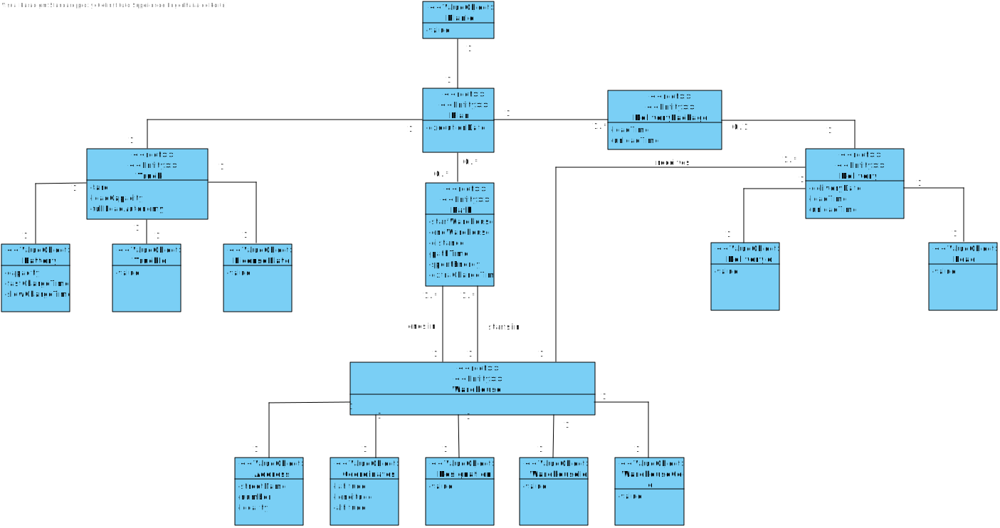

# Sprint 1 Diagrams

The documentation is using C4+1 model. We have 3 levels:

- Level 1 - Context
- Level 2 - Containers
- Level 3 - Components
- Level 4 - Code

---

We decided to create an additional 2.5th level in order to place the database inside the container, maintaining the 3rd level as component.

All diagrams are under Diagrams folder with the following structure:

- Level 1
  - [Logical View](Diagrams/Level%201/N1-LV.svg)
  - Process View
    - [US-LS75-2](Diagrams/Level%201/Processes/N1-PV-US2.svg)
    - [US-LS75-7](Diagrams/Level%201/Processes/N1-PV-US7.svg)
    - [US-LS75-12](Diagrams/Level%201/Processes/N1-PV-US12.svg)
    - [US-LS75-22](Diagrams/Level%201/Processes/N1-PV-US22.svg)
    - [US-LS75-27](Diagrams/Level%201/Processes/N1-PV-US27.svg)
    - [US-LS75-32](Diagrams/Level%201/Processes/N1-PV-US32.svg)
    - [US-LS75-42](Diagrams/Level%201/Processes/N1-PV-US42.svg)
    - [US-LS75-47](Diagrams/Level%201/Processes/N1-PV-US47.svg)
    - [US-LS75-52](Diagrams/Level%201/Processes/N1-PV-US52.svg)
    - [US-LS75-57](Diagrams/Level%201/Processes/N1-PV-US57.svg)
    - [US-LS75-62](Diagrams/Level%201/Processes/N1-PV-US62.svg)
    - [US-LS75-67](Diagrams/Level%201/Processes/N1-PV-US67.svg)
    - [US-LS75-92](Diagrams/Level%201/Processes/N1-PV-US92.svg)
    - [US-LS75-97](Diagrams/Level%201/Processes/N1-PV-US97.svg)
    - [US-LS75-102](Diagrams/Level%201/Processes/N1-PV-US102.svg)
  - [Scenarios View](Diagrams/Level%201/N1-SV.svg)
- Level 2
  - [Logical View](Diagrams/Level%202/N2-LV.svg)
  - Process View
    - [US-LS75-2](Diagrams/Level%202/Processes/N2-PV-US2.svg)
    - [US-LS75-7](Diagrams/Level%202/Processes/N2-PV-US7.svg)
    - [US-LS75-12](Diagrams/Level%202/Processes/N2-PV-US12.svg)
    - [US-LS75-22](Diagrams/Level%202/Processes/N2-PV-US22.svg)
    - [US-LS75-27](Diagrams/Level%202/Processes/N2-PV-US27.svg)
    - [US-LS75-32](Diagrams/Level%202/Processes/N2-PV-US32.svg)
    - [US-LS75-42](Diagrams/Level%202/Processes/N2-PV-US42.svg)
    - [US-LS75-47](Diagrams/Level%202/Processes/N2-PV-US47.svg)
    - [US-LS75-52](Diagrams/Level%202/Processes/N2-PV-US52.svg)
    - [US-LS75-57](Diagrams/Level%202/Processes/N2-PV-US57.svg)
    - [US-LS75-67](Diagrams/Level%202/Processes/N2-PV-US67.svg)
    - [US-LS75-62](Diagrams/Level%202/Processes/N2-PV-US62.svg)
    - [US-LS75-92](Diagrams/Level%202/Processes/N2-PV-US92.svg)
    - [US-LS75-97](Diagrams/Level%202/Processes/N2-PV-US97.svg)
    - [US-LS75-102](Diagrams/Level%202/Processes/N2-PV-US102.svg)
  - [Implementation View](Diagrams/Level%202/N2-IV.jpg)
  - [Physical View](Diagrams/Level%202/N2-PIV.jpg)
- Level 2.5
  - Logical View
    - [Warehouse Management](Diagrams/Level%202.5/N2.5-LV-LM.svg)
    - [Logistic Management](Diagrams/Level%202.5/N2.5-LV-WM.svg)
  - Process View
    - [US-LS75-2](Diagrams/Level%202.5/Processes/N2.5-PV-US2.svg)
    - [US-LS75-12](Diagrams/Level%202.5/Processes/N2.5-PV-US12.svg)
    - [US-LS75-22](Diagrams/Level%202.5/Processes/N2.5-PV-US22.svg)
    - [US-LS75-47](Diagrams/Level%202.5/Processes/N2.5-PV-US47.svg)
    - [US-LS75-57](Diagrams/Level%202.5/Processes/N2.5-PV-US57.svg)
    - [US-LS75-67](Diagrams/Level%202.5/Processes/N2.5-PV-US67.svg)
    - [US-LS75-62](Diagrams/Level%202.5/Processes/N2.5-PV-US62.svg)
    - [US-LS75-97](Diagrams/Level%202.5/Processes/N2.5-PV-US97.svg)
    - [US-LS75-102](Diagrams/Level%202.5/Processes/N2.5-PV-US102.svg)
  - Implementation View
    - [Warehouse Management](Diagrams/Level%202.5/N2.5-IV-WM.jpg)
    - [Logistic Management](Diagrams/Level%202.5/N2.5-IV-LM.jpg)
- Level 3
  - Logical View
    - [Warehouse Management](Diagrams/Level%203/N3-LV-WM.svg)
    - [Logistic Management](Diagrams/Level%203/N3-LV-LM.svg)
  - Process View
    - [US-LS75-2](Diagrams/Level%203/Processes/N3-PV-US2.svg)
    - [US-LS75-7](Diagrams/Level%203/Processes/N3-PV-US7.svg)
    - [US-LS75-12](Diagrams/Level%203/Processes/N3-PV-US12.svg)
    - [US-LS75-22](Diagrams/Level%203/Processes/N3-PV-US22.svg)
    - [US-LS75-27](Diagrams/Level%203/Processes/N3-PV-US27.svg)
    - [US-LS75-32](Diagrams/Level%203/Processes/N3-PV-US32.svg)
    - [US-LS75-42](Diagrams/Level%203/Processes/N3-PV-US42.svg)
    - [US-LS75-47](Diagrams/Level%203/Processes/N3-PV-US47.svg)
    - [US-LS75-52](Diagrams/Level%203/Processes/N3-PV-US52.svg)
    - [US-LS75-57](Diagrams/Level%203/Processes/N3-PV-US57.svg)
    - [US-LS75-67](Diagrams/Level%203/Processes/N3-PV-US67.svg)
    - [US-LS75-62](Diagrams/Level%203/Processes/N3-PV-US62.svg)
    - [US-LS75-92](Diagrams/Level%203/Processes/N3-PV-US92.svg)
    - [US-LS75-97](Diagrams/Level%203/Processes/N3-PV-US97.svg)
    - [US-LS75-102](Diagrams/Level%203/Processes/N3-PV-US102.svg)
  - Implementation View
    - [Warehouse Management](Diagrams/Level%203/N3-IV-WM.jpg)
    - [Logistic Management](Diagrams/Level%203/N3-IV-LM.jpg)

---

## Domain Model

## Use Case Diagram

